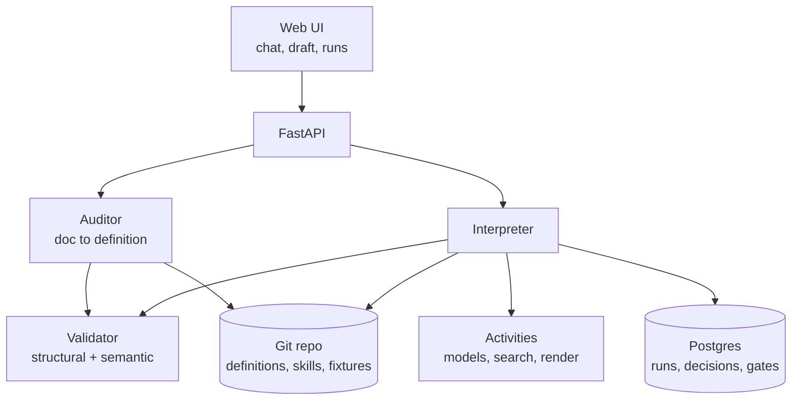

# Agentic workflows: technical design and plan

## What this covers

The design for the prototype described in the product requirements: the audit path first, the run loop behind it. It is written to be built against, and to be argued with where the decisions are close.

| Decision | Choice | Reversible? |
| --- | --- | --- |
| A. Compile or interpret the definition | Interpret now, keep it compilable by constraining the schema | Yes, if the schema rules hold |
| B. Language, runtime, durable execution | Python, on a bought durable execution engine, adopted at Phase 2 | Costly after Phase 2 starts |
| C. Where definitions and instructions live | Git-backed markdown and YAML, indexed in Postgres | Hard to reverse once customers edit in the UI |
| D. What the prototype is | Real model calls, stubbed tools, fixtures for data, nothing sent | Per-demo choice, not architectural |

The prototype is judged on whether it surfaces the gaps in a real process and explains itself while doing so, not on throughput or generality.

## Decision A: interpret now, stay compilable

The definition is executed by an interpreter that walks the YAML. It is not generated into workflow code.

Compilation is invisible to users. What they experience is enforcement, legible failure and edits that take effect, and both approaches deliver all three. So this is an engineering trade, not a product one.

|  | Interpreter | Compiler |
| --- | --- | --- |
| Edit takes effect | Immediately | After a build step |
| Schema churn | Absorbed | Ossifies the shape |
| Failure reporting | Step id plus definition, which is what the UI shows anyway | Stack trace, needs mapping back |
| Portability off our platform | None | Strong, and a v2 concern at best |

Schema churn decides it. The shape will change weekly for months.

**The rules that keep compilation open.** The definition must stay a static description of a program. If any of these is broken, the choice has been made for us silently:

- No inline code or expressions with side effects. Expressions read state and nothing else.
- No steps created at runtime. Fan-out is a declared step over a list, with a limit.
- No instruction that can add, remove or reorder steps. Agents propose; only declared steps act.
- Control flow lives in `when`, `for_each` and `may_repeat`, never inside a prompt.
- The interpreter is deterministic given the same definition, inputs and recorded step outputs. All non-determinism sits inside step execution, behind the runtime's activity boundary.

That last rule is what makes replay work later, and it is the one worth enforcing with a test from day one.

## Decision B: language and runtime

**Python, FastAPI, Postgres.** The agent steps, the interpreter and the audit all live in one process. The reason is the model and tool ecosystem, not preference: everything we call is Python-first, and splitting the interpreter from the step execution would buy nothing at this size.

**Durable execution is bought, not built, and adopted at Phase 2.** Phase 1 (audit and dry run) needs a run that completes in minutes and never waits for a human, so it runs in-process with state in Postgres. Phase 2 adds waits of days, resume after failure and budget pauses, which is where a real engine earns its cost.

| Engine | For us | Against |
| --- | --- | --- |
| Temporal | The mature option, Python SDK, human-in-the-loop waits are a first-class pattern; reported an OpenAI Agents SDK integration reaching GA in March 2026 | Heaviest to operate, most concepts to learn |
| Restate | Lighter to run, simpler model | Smaller ecosystem, less proven at long waits |
| DBOS | Postgres-backed, minimal infrastructure, fits our existing store | Youngest, and the bet is on it staying maintained |

Recommendation: Temporal, decided before Phase 2 starts rather than now. The interpreter is written so its step boundary is already an activity boundary, which is what makes the adoption a wiring job instead of a rewrite.

**What this constrains.** Every side effect (model call, web fetch, PDF render, email send) goes behind an activity interface from day one, with retries and timeouts declared there. No step calls the network directly.

## Decision C: where definitions and instructions live

**One git repository per workspace.** Definitions as YAML, instruction files as markdown, fixtures for dry runs beside them. Postgres holds runs, decisions, gates and baselines, plus an index of what is in the repo.

This is chosen for the trust model rather than developer taste. Instruction versions must be immutable, comparable and attributable, because a run records which version produced each artefact, a change resets a step's trust, and baselines are re-run against a specific version. Git gives all of that for free, and a commit is already the unit of change we show in the diff.

**How it works with UI editing.** Users never see git. Editing an instruction in the UI writes a commit on a branch with the user as author. Keeping the change writes it to the main branch; reverting drops the branch. A step's `skill: research-brief.md@3` resolves to a commit, not a file, so a run is always reproducible against exactly what it ran with.

**What we lose.** Concurrent edits to the same file need a merge story, and git is the wrong store for anything high-frequency. So nothing per-run goes in the repo: decisions, logs, artefacts and costs are all Postgres rows.

**Alternative considered.** Instructions as database rows with a version table. Simpler to edit, no merge semantics, but we would rebuild diffing, history and blame, and the maintainer loses the ability to work on definitions outside the product.

## The definition schema

The schema is the product's engine, not a serialisation format. Gap questions are required fields the compiler cannot fill from the customer's document, which is what makes them consistent across processes and hard to copy with a prompt.

**Step kinds.** `agent` (judgement, needs a model and instructions), `check` (deterministic, no model), `tool` (an action with declared side effects), `subworkflow` (declared recursion), `wait` (a human or external event, with a deadline).

**Required on every step:** `id`, `kind`, `title` in the user's language, `shows_user`, and `trust`. Required by kind: `model` and `skill` for agents; `run`, `checks` and `does_not_check` for checks; `side_effects` and `requires_approval` for tools; `limits` for subworkflows; `deadline` and `on_timeout` for waits. A branch needs `when`; a `for_each` needs a `max_fanout`.

**Each unfilled field is a question:**

| Field | Question the user sees |
| --- | --- |
| `when` on a branch | What decides which way this goes? |
| `does_not_check` | What does this check not tell you? |
| `requires_approval` | Who signs this off before it leaves the system? |
| `deadline` / `on_timeout` | How long do you wait, and then what? |
| `limits` | How far can this go, and how much can it spend? |
| enum of an output the next step branches on | Which outcomes are possible here? |

**Two validation passes.** *Structural*: required fields, references resolve, no cycles outside a declared `subworkflow`, every branch covered, fan-out and depth bounded, budget present if anything can recurse. *Semantic*: outputs referenced by later steps exist in the producing step's schema, every `when` reads a field that is actually produced, and every branch value appears in that field's enum. The second pass is what catches an unstated branch, which is the most common real gap.

**Findings are typed,** because gaps and conflicts land differently with a customer: `gap` (the document is silent), `conflict` (a step cannot work as written, quoting their words), `assumption` (we filled it in, marked, reversible), `unreachable` (a branch nothing can produce).

## Architecture and data model

The validator sits under both paths on purpose: the audit and a live run judge a definition by exactly the same rules, so a gap found at audit time is the same object as a failure at run time.

**Core records.**

| Record | Holds | Notes |
| --- | --- | --- |
| `workflow_version` | Definition commit, schema version | Immutable; a run pins one |
| `run` | Workflow version, inputs, status, depth, parent run, budget spent, mode | `mode` is `live`, `dry` or `eval`; `dry` is what the audit produces |
| `step_run` | Step id, status, attempt, input and output refs, cost, duration, instruction commit, model | The row the run UI reads |
| `decision` | Step run, decision text, reason, alternatives considered | Written by agent steps; user-facing language, not a trace |
| `gate` | Step run, what was shown, user action, edits made, timestamp, actor | Feeds trust promotion and the audit trail |
| `trust_state` | Workflow, step id, consecutive accepts, reset cause and time | Reset on any change to model, skill, tools or schemas |
| `finding` | Audit or run, type, field, question, quoted source text, answer | Same shape whether raised at audit or hit during a dry run |
| `baseline` | Run marked good, inputs, expected shape, marked by, when | What a change is re-run against |
| `artifact` | Blob ref, produced by step run, simulated flag | The flag travels with the file, not just the screen |

**Two properties worth protecting.** Every artefact traces to a step run, which traces to an instruction commit and a model. And `simulated` is a property of the artefact, so a dry-run PDF carries its marking wherever it goes.

## Audit and dry run

1. **Ingest.** Their document, split into addressable passages so every finding can quote its source.
2. **Extract.** A model proposes steps and fills what the document states. It may only emit schema-valid fragments, and every field it fills carries the passage it came from. Anything unsupported is left empty rather than invented.
3. **Validate.** Structural then semantic. Unfilled required fields and failed semantic rules become `finding` rows. This is where the questions come from, not from asking a model what is missing.
4. **Question.** Findings are grouped by kind and asked in the user's language, ordered by how much of the process each unblocks. Answers write back into the definition and close the finding.
5. **Diff.** Their document beside the definition: what it said, what is now explicit, what we assumed.
6. **Dry run.** Execute against a past case they know. Model calls are real. Tools are stubbed: search returns fixtures, fetches return recorded responses, sends are recorded and dropped. Cost is estimated from real token counts.
7. **Report.** Guess points first, findings second, the simulated artefact last.

**Where the dry run had to guess.** When the interpreter reaches an unanswered required field mid-run, it does not fail. It picks the most likely value, records a `guess` decision naming the finding, and continues. That is the screen that matters: each guess is a place the process is silent, discovered by execution rather than by inspection.

**Divergence.** Their known outcome is entered as an expectation before the run. Where the run differs, it reports the first step whose decision put them on different paths, rather than only the end state.

**Fixtures.** Recorded responses keyed by request, committed to the repo beside the definition. Same fixtures every run, so what varies between two runs is model judgement alone, which is what makes running the demo twice mean something.

**Cost of realism.** Real model calls make the audit non-deterministic and slower. That is accepted, and it is the behaviour customers need to see before they trust anything else.

## Security controls

**Fetched content is data.** A research workflow reads untrusted pages by design. Retrieved text enters a step's context inside a delimited data region, never as instruction, and a step's tool permissions come from the definition, so no page can widen them. Attempted instructions in fetched content are recorded as a decision the user can see, rather than silently dropped. Same rule for the customer's own process document during the audit: it is material to compile, not a source of instructions.

**Capability changes need consent.** A suggestion that adds a tool, grants write access or side effects, raises a limit, or adds a trigger requires explicit approval and resets the affected step's trust. A suggestion that adds a check, a `does_not_check` line or more visibility applies by default. The split is enforced by classifying the proposed diff against the schema, not by asking a model whether its suggestion is risky.

**Recursion is bounded by construction.** Depth, fan-out and a budget shared with children are validated before a run starts and enforced by the interpreter. An agent can propose follow-up topics; only the `subworkflow` step starts them, and only after approval.

**Side effects are declared and gated.** A `tool` step declares `side_effects`, and anything leaving the system needs approval in Phase 2, never runs in `dry` mode, and is recorded with what would have been sent.

**Everything is attributable.** Instruction commit, model, tool calls, and which human approved which gate, per step run. This is the audit trail regulated customers ask for, and it falls out of the records above.

**Link checks record their vantage point.** Time of check and from where, because "reachable from our network then" is not "reachable by you now". This is a real failure we have hit: a report whose sources all timed out for the reader.

## Implementation plan

Each milestone ends in something showable to a user, because validation runs alongside the build rather than after it.

| # | Milestone | Done when | Demonstrates |
| --- | --- | --- | --- |
| 1 | Schema and validator | Deep research validates; a mangled copy produces the right findings | The gaps come from structure |
| 2 | Interpreter, in-process | Deep research runs end to end with real model calls, stubbed tools, decisions recorded | The definition is enforced, not requested |
| 3 | Auditor | A process document becomes a draft definition with sourced fields and typed findings | Give me your process, get questions back |
| 4 | Dry run and guess points | Runs against a past case, records guesses, reports divergence, marks the artefact simulated | Shows the cracks instead of asserting them |
| 5 | Audit UI | Questions, definition, document diff, dry run result | The demo surface |
| 6 | Gates and trust | Brief gate pauses, records the gate, promotes after repeated accepts | Validate each step |
| 7 | Durable runtime | Engine adopted; resume after failure and after a budget pause | Recovery, the n8n gap |
| 8 | Recursion with limits | Follow-ups approved by a human, depth and shared budget enforced | Bounded agency |
| 9 | Run list | Runs, nested follow-ups, cost, what was decided, instruction versions | Legible over time |
| 10 | Baselines and change diffs | Mark good; an edit re-runs against baselines in a sandbox and shows a diff before applying | Changes tested before they go live |
| 11 | Shape B | The customer's failed process, audited, with sends stubbed | It generalises past deep research |

**Sequence.** Milestones 1 to 5 are the demo path and are strictly ordered. 6 onward can be reordered by what user sessions demand; 11 waits on the customer's document, so start it whenever that lands rather than holding a slot for it.

**Two things built early that are usually left late.** A determinism test on the interpreter, guarding the replay property in Decision A. And the `simulated` flag plumbed through artefacts from milestone 4, because retrofitting it means a mock report escapes at some point.

**Estimates.** Deliberately absent. Milestones 1 to 5 are scoped to be demonstrable within a week of focused work; past that, sequence matters more than dates until user sessions start reordering the list.

## Demo plan and open questions

**The demo is milestones 1 to 5.** Run a private dry run first, so we know where the process forks before showing it, and can say beforehand which step to watch.

The sequence: the process document, then the questions it could not answer, then the definition beside their document, then the dry run. Then run it a second time and diff the decision logs, not the outputs. Say plainly what stays identical every time — steps, limits, gates, budget, checks — and that only the judgement inside steps varies. That framing is what stops non-determinism reading as unreliability.

Have the answer ready for "so how do I trust it?": not by trusting one run, but by seeing the decisions, gating the expensive ones, and testing changes against results you approved.

**Fallbacks.** If both runs agree, the findings still carry the session. If the customer's document does not arrive, run the audit on a deep research process we degrade on purpose, and say that is what we did.

**Open questions.**

- [ ] Which durable execution engine, decided before milestone 7
- [ ] How much the extractor may infer before a filled field becomes an `assumption` finding
- [ ] Whether findings are ordered by what they unblock or by confidence
- [ ] Merge behaviour when two people edit one instruction file
- [ ] Whether a step's `trust` promotion is per workflow or per workflow version
- [ ] Where fixtures come from for a process whose real tools we cannot call at all

**Not settled here, and deliberately so:** multi-tenancy, auth, deployment and anything about scale. The prototype runs for one workspace.
